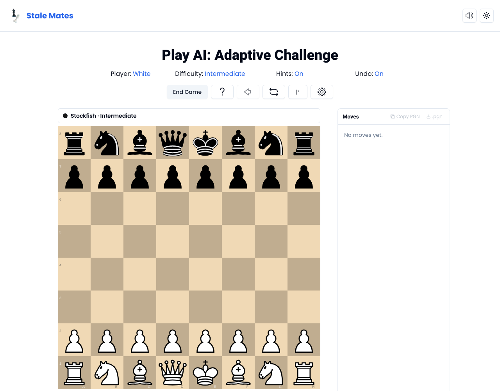

# Stalemates: A Full-Stack Chess Platform

Stalemates is an interactive chess platform where users can play against AI or other players in real-time, showcasing the power of modern web technologies in creating engaging, multiplayer experiences. [Play Stalemates Now](https://stalemates.magedfaiz.xyz/)



## Table of Contents

- [Stalemates: A Full-Stack Chess Platform](#stalemates-a-full-stack-chess-platform)
  - [Table of Contents](#table-of-contents)
  - [Introduction](#introduction)
  - [Features](#features)
  - [Tech Stack](#tech-stack)
    - [Frontend](#frontend)
    - [Backend](#backend)
    - [Chess Logic](#chess-logic)
    - [Build Tools](#build-tools)
  - [Getting Started](#getting-started)
    - [Prerequisites](#prerequisites)
    - [Installation](#installation)
  - [Scripts](#scripts)
  - [Deployment](#deployment)
    - [Two-Target Split](#two-target-split)
    - [Why the Backend Can't Be Serverless](#why-the-backend-cant-be-serverless)
    - [Environment Variables](#environment-variables)
    - [Deploying the Frontend (Vercel)](#deploying-the-frontend-vercel)
    - [Deploying the Backend (Fly.io / Docker)](#deploying-the-backend-flyio--docker)
  - [Contributing](#contributing)
  - [License](#license)
    - [Third-Party Licenses](#third-party-licenses)

## Introduction

Stalemates was born out of a passion for chess and a desire to explore the capabilities of SvelteKit and WebSocket technology in creating a seamless gaming experience. You can read a detailed breakdown of the project's development journey [here](https://www.magedfaiz.xyz/projects/stalemates).

## Features

- Play against an AI opponent (Stockfish) with adjustable difficulty, hints and takebacks;
  in-progress AI games survive a page refresh
- Real-time multiplayer with a one-step invite link, server-authoritative clocks and
  results, reconnect handling and rematches
- Move list with PGN copy/download, last-move highlighting, sound cues (with a mute
  toggle) and screen-reader move announcements
- Draw offers, colour-swapping rematches and claim-the-win when an opponent abandons
  (clocks don't pause while a player is disconnected — a timed game can still be lost
  on time while away)
- Timed games follow the Lichess convention: no clock runs until each side has made its
  first move (White's clock starts after Black's first move; those first moves earn no
  increment). Each side has 30 s (`FIRST_MOVE_TIMEOUT_MS`) for its first move, or the
  game is aborted — no winner, PGN result `*`, rematch available
- Keyboard play: type moves in SAN (`Nf3`, `O-O`) or coordinates (`e2e4`)
- A responsive chessboard with player bars, clocks, light/dark mode and board colour themes
- Works offline for AI games once visited (service worker)

## Tech Stack

### Frontend

- SvelteKit 3 + Svelte 5 (runes), Vite 8: the user interface
- Tailwind CSS 4: styling
- shadcn-svelte (bits-ui 2, vaul-svelte): accessible UI primitives
- chessground 9 (via a small in-repo Svelte 5 wrapper): the interactive chessboard

### Backend

- Express.js: Powering the server-side logic and API
- WebSockets: Enabling real-time communication for multiplayer games

### Chess Logic

- chess.js: Handling game rules, move validation, and board state
- Stockfish 18 (WebAssembly, in a Web Worker): the AI opponent with adjustable difficulty

### Build Tools

- Vite: For fast development and optimized production builds
- TypeScript: For type-safe JavaScript development

## Getting Started

Follow these instructions to get Stalemates up and running on your local machine for development and testing purposes.

### Prerequisites

- Node.js 22.17+ (see `.nvmrc`; SvelteKit 3 needs >= 22.17, `engines` accepts up to 24)
- Bun 1.2+ (the lockfiles are text `bun.lock`; CI pins Bun 1.4.2)

### Installation

1. **Clone the repository:**

   ```bash
   git clone https://github.com/Maiz27/stale-mates.git
   cd stale-mates
   ```

2. **Install dependencies:**

   ```bash
   bun i
   ```

3. **Set up environment variables:**

   - Copy `.env.example` to `.env` in the root directory
   - Copy `api/.env.example` to `api/.env`

4. **Install API dependencies:**

   ```bash
   cd api
   bun i
   ```

5. Stockfish: a single-threaded WebAssembly build of Stockfish 18 is vendored in
   `static/engine/stockfish-18.0.8/` — no setup needed.

## Scripts

Frontend (repo root):

| Script              | What it does                                                          |
| ------------------- | --------------------------------------------------------------------- |
| `bun run dev`       | SvelteKit dev server (http://localhost:5173)                          |
| `bun run build`     | Production build (adapter-vercel, `nodejs22.x` runtime)               |
| `bun run preview`   | Serve the production build locally (http://localhost:4173)            |
| `bun run check`     | `svelte-kit sync` + `svelte-check` type checking                      |
| `bun run lint`      | `prettier --check .` and `eslint .`                                   |
| `bun run format`    | Format everything with Prettier                                       |
| `bun run test:unit` | Vitest unit tests (`src/**/*.test.ts`)                                |
| `bun run test:e2e`  | Playwright end-to-end tests (builds + previews the app, starts `api`) |
| `bun run api`       | Run the backend in watch mode                                         |
| `bun run dev:all`   | Frontend + backend together                                           |

Backend (`api/`): `bun run dev`, `bun run build`, `bun run start`, `bun run test`,
`bun run lint`, `bun run format`.

### Testing

- **Unit (frontend):** `bunx vitest run` — pure chess core, game model, formatting
  helpers, the WebSocket manager and the game modes (with fake engine/socket).
- **Unit (backend):** `cd api && bunx vitest run` — `GameRoom` (moves, clocks,
  reconnects, draw offers, rematch), the clock/outcome modules, env validation, the
  rate limiter, the room sweep and the inbound message validator.
- **End-to-end:** `bun run test:e2e`. The Playwright config builds and previews the
  frontend and starts the API on :3000, building the frontend with
  `VITE_API_URL`/`VITE_API_WS_URL` pointed at it (unless you export your own), so no
  `.env` is needed.
  Install a browser once with `bunx playwright install chromium` (or point
  `PW_CHROMIUM_EXECUTABLE` at an existing Chromium).

## Deployment

Stalemates ships as **two separate deployment targets** that must be deployed independently.

### Two-Target Split

| Target   | Code                    | Host                                             | How              |
| -------- | ----------------------- | ------------------------------------------------ | ---------------- |
| Frontend | repo root (SvelteKit)   | Vercel                                           | `adapter-vercel` |
| Backend  | `api/` (Express + `ws`) | A stateful host such as [Fly.io](https://fly.io) | `api/Dockerfile` |

The frontend is a stateless SvelteKit app and deploys cleanly to Vercel's serverless platform. The backend is a long-lived, single-instance Express + WebSocket server and must run on a host that keeps a persistent process alive.

### Why the Backend Can't Be Serverless

The backend stores active game rooms in an **in-memory `Map`** inside a single long-lived process. Serverless platforms (including Vercel) spin up short-lived, horizontally-scaled instances with no shared memory and no persistent WebSocket connections, so game state would be lost or split across instances. The backend therefore runs as **exactly one always-on instance**. The provided `api/fly.toml` enforces this with `auto_stop_machines = false` and `min_machines_running = 1`.

### Environment Variables

**Frontend (Vercel project env):**

- `VITE_API_URL` — HTTPS base URL of the deployed backend (e.g. `https://stalemates-api.fly.dev`)
- `VITE_API_WS_URL` — WebSocket base URL of the deployed backend (e.g. `wss://stalemates-api.fly.dev`)
  (optional: derived from `VITE_API_URL` when unset). A dev server with neither falls back
  to `http://localhost:3000`; a production build with neither shows "no game server
  configured" instead of trying to connect.

**Backend (Fly secrets / container env):**

- `ORIGIN` — the deployed frontend origin(s), comma-separated, used for CORS and the
  WebSocket `Origin` allowlist (e.g. `https://stalemates.magedfaiz.xyz`). Each entry is
  normalised (`https://site/` → `https://site`); an entry with a path, query or fragment,
  or a non-http(s) scheme, stops the server at startup. The parsed allowlist is logged.
- `ORIGIN_PATTERNS` — optional, for preview deployments; only a soft guard on a shared
  domain such as `vercel.app` (see below).
- `PORT` — port the server listens on (defaults to `3000`)
- `ROOM_TTL_MS` — how long an empty room is kept before the sweep reaps it (ms,
  default `1800000` = 30 min). Disconnected players can rejoin until then.
- `DISCONNECT_GRACE_MS` — how long a disconnected player has before the opponent may
  claim the win (ms, default `60000`).
- `FIRST_MOVE_TIMEOUT_MS` — timed games: how long each side has for its first move
  before the game is aborted (ms, default `30000`).
- `TRUST_PROXY` — how many reverse-proxy hops to trust for the client IP in
  `X-Forwarded-For` (default `0`: use the socket address, right when the server is exposed
  directly). Set `1` behind one reverse proxy such as Fly.io's edge (`api/fly.toml` does),
  or every client shares the proxy's IP for the per-IP limits.
- `MAX_WS_CONNECTIONS_PER_IP` — concurrent WebSocket connections allowed from one client
  IP (default `20`); extra connections are closed with `1013`.

### Deploying the Frontend (Vercel)

Connect the repository to a Vercel project, set `VITE_API_URL` and `VITE_API_WS_URL` in the project's environment variables, and deploy. `adapter-vercel` handles the build.

**Preview deployments.** Every Vercel preview has its own URL, which the backend's exact
`ORIGIN` list can't know, so multiplayer is refused there (`Origin not allowed`). Pick one:

- **Leave previews without a game server** (simplest, safest): set `VITE_API_URL` /
  `VITE_API_WS_URL` for the _Production_ environment only. Preview builds then show "no
  game server configured" on the multiplayer page; single-player works.
- **Allow this project's previews** on the backend with an opt-in pattern (a soft guard
  on `vercel.app` — see the caveat below):

  ```bash
  fly secrets set ORIGIN_PATTERNS='https://stale-mates-*-maiz27s-projects.vercel.app'
  ```

  and set `VITE_API_URL` / `VITE_API_WS_URL` for the _Preview_ environment too. A pattern
  is https-only with exactly one `*` in the first host label, after a non-empty literal
  prefix (`https://*.vercel.app` is refused at startup — it would admit everyone's apps);
  the `*` never matches a dot.

  **On `vercel.app` this is only a soft guard.** Vercel project names are free-form
  (`[a-z0-9-]`), and a production deployment is served at `<project-name>.vercel.app`, so
  _any_ Vercel account can create a project named, say,
  `stale-mates-x-maiz27s-projects` and get a host the pattern above accepts. The team
  suffix only keeps out deployments that don't try. Seat tokens never leave the site's own
  storage, so such a site can't take over existing games, but it can open game sockets
  and create rooms from its visitors' browsers. The server logs a startup warning for any
  pattern directly under a shared hosting domain (`vercel.app`, `netlify.app`, `pages.dev`,
  `fly.dev`, …). For a hard boundary, leave `VITE_API_URL` unset in the Preview
  environment (previews are AI-only — the recommended setup), or serve previews from a
  custom preview domain you control (e.g. `https://pr-*.preview.example.com`).

### Deploying the Backend (Fly.io / Docker)

The backend deploys from `api/Dockerfile` (multi-stage: `tsc` build, production-only runtime). A `HEALTHCHECK` hitting `/health` is built in.

Using Fly.io (config in `api/fly.toml`, app name `stalemates-api`):

```bash
cd api
fly launch --copy-config --no-deploy   # first time only; reuses fly.toml
fly secrets set ORIGIN=https://stalemates.magedfaiz.xyz
fly deploy
```

Or build and run the container directly with Docker:

```bash
cd api
docker build -t stalemates-api .
docker run -p 3000:3000 \
  -e ORIGIN=https://stalemates.magedfaiz.xyz \
  -e PORT=3000 \
  stalemates-api
```

The health endpoint is available at `GET /health` and returns `{ "status": "ok", "rooms": <count> }`.

## Contributing

Contributions are welcome! Please feel free to submit a Pull Request.

## License

This project is open source and available under the GNU General Public License v3.0 (GPL-3.0). This license has been chosen to comply with the licensing requirements of some of our key dependencies:

- chess.js is licensed under the BSD 2-Clause license.
- Chessground is licensed under the GPL-3.0 license.

As per the requirements of the GPL-3.0 license:

1. The source code of this project must be made available when distributing the software.
2. Modifications of this project must be released under the same license.
3. Changes made to the code must be documented.

For the full license text, please see the [LICENSE](LICENSE) file in this repository.

### Third-Party Licenses

This project incorporates third-party software. The licenses for these are included in their respective repositories:

- chess.js: [BSD 2-Clause License](https://github.com/jhlywa/chess.js/blob/master/LICENSE)
- Chessground: [GPL-3.0 License](https://github.com/lichess-org/chessground/blob/master/LICENSE)
- Stockfish 18 (vendored WebAssembly build in `static/engine/stockfish-18.0.8/`, from stockfish.js):
  [GPL-3.0 License](https://github.com/official-stockfish/Stockfish/blob/master/Copying.txt).
  Its source is available from the [Stockfish project](https://github.com/official-stockfish/Stockfish)
  and the [stockfish.js port](https://github.com/nmrugg/stockfish.js).

Please make sure to comply with all license terms when using or modifying this software.
